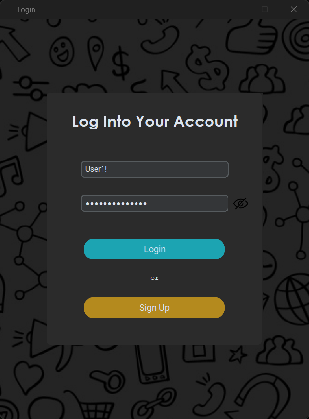
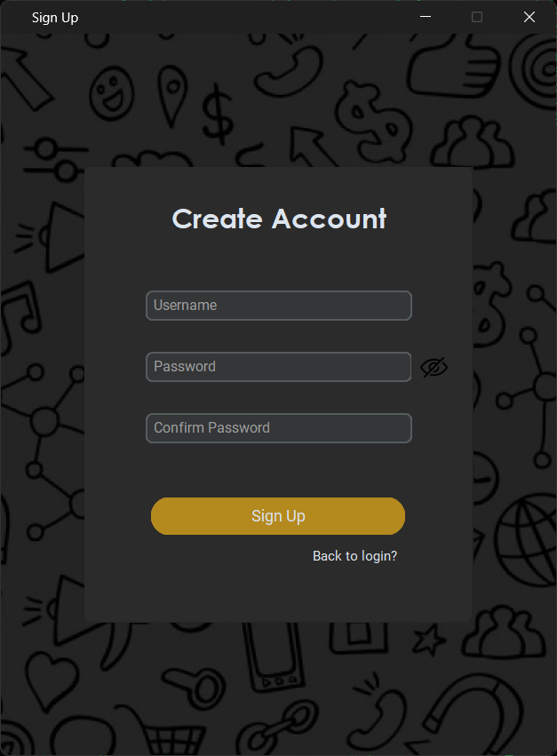
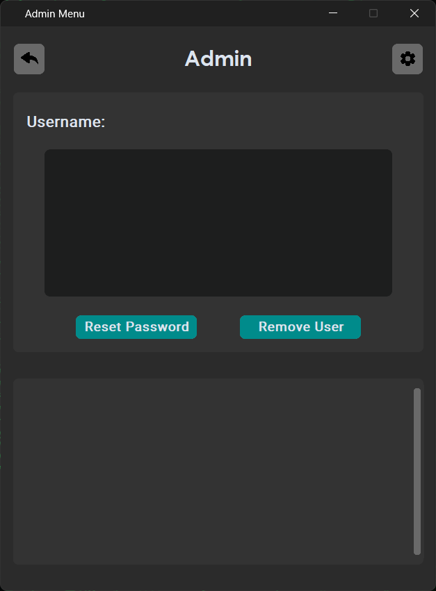
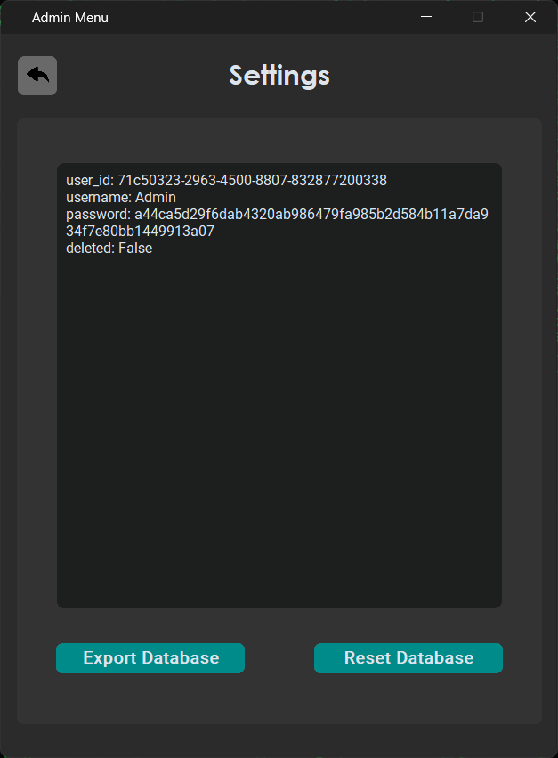

<h1 align="center">
  <a href="https://amplication.com/#gh-light-mode-only">
  
  </a>
  <a href="https://amplication.com/#gh-dark-mode-only">
  
  </a>
</h1>

<h4 align="center">A login system built with <a href="https://github.com/TomSchimansky/CustomTkinter" target="_blank">CustomTkinter</a>.</h4>

<p align="center">
  
  <a href="https://opensource.org/licenses/MIT">
    
  </a>
  
  <a href="https://www.python.org/">
    
  </a>
</p>

<p align="center">
  <a href="#screenshots">Screenshots</a> • 
  <a href="#key-features">Key Features</a> •
  <a href="#getting-started">Getting Started</a> •
  <a href="#license">License</a>
</p>

## Screenshots

<p align="center">
  
  

<p align="center">
  
  

## Key Features

- **Custom GUI with `customtkinter`:** The application utilizes the **`customtkinter`** library to provide a modern and customizable graphical user interface (GUI), enhancing the visual appeal and user experience.


- **Secure User Authentication:**

  - **Password Hashing:** User passwords are securely hashed using the **`sha256`** algorithm before being stored, ensuring that plain-text passwords are never saved.
  - **User Management:** Includes the ability to create new users, with a default administrator account created if no users exist in the system.
  - **Password Visibility Toggle:** Users can toggle the visibility of their password input with a single click, enhancing usability without compromising security.
 

- **Responsive Design:** The application is designed to fit a fixed window size, ensuring that the layout remains consistent across different screen resolutions.

- **Persistent User Data:**

  - **Local Storage:** User data is stored locally in a JSON file, allowing the application to maintain user credentials across sessions.
  - **Error Handling:** The application gracefully handles missing or corrupt user data files, automatically creating a new user database if needed.
 

- **Admin Panel with Database Settings:**

  - **Admin-Only Access:** The settings menu is accessible exclusively through the Admin panel, allowing only the Admin user to make settings to the database.
  - **Settings Management:** The Admin user can access various settings, including deleting users and changing passwords.


- **Visual Feedback and Accessibility:**

  - **Hover Effects:** Interactive elements, such as buttons, provide visual feedback on hover, improving accessibility and user interaction.
  - **Consistent Iconography:** The application uses a consistent set of icons for common actions like showing/hiding passwords, navigating, and accessing settings.


- **Extensible and Modular Design:**

  - **Easily Extendable:** The codebase is structured in a modular fashion, making it easy to extend or customize the application for different use cases.
  - **Resource Management:** External resources like images and icons are managed efficiently, ensuring the application's responsiveness and performance.


## Getting Started

### Prerequisites
- Python 3.12
- `customtkinter` library
- `PIL` (Pillow) library
> **Note:** May work with other versions but only tested on 3.12.

### Installation
1. **Clone the Repository:**
   ```bash
   git clone https://github.com/Master-Programmer-2010/CTk-Login-Menu.git
   ```

2. **Navigate to the project directory:**
   ```bash
   cd CTk-Login-Menu
   ```

3. **Create a virtual environment (optional but recommended):**
   ```bash
   python -m venv env
   ```

4. **Activate the virtual environment:**
   -**On Windows:**
   ```bash
   .\env\Scripts\activate
   ```

   -**On macOS/Linux:**
   ```bash
   source env/bin/activate
   ```

5. **Install the required dependencies:**
   ```bash
   pip install -r requirements.txt
   ```

### Running the Application

To start the application, use the following command:
```bash
python main.py
```

### Initial Setup

After completing the installation, you can log in with the default admin credentials:

- **Username:** `Admin`
- **Password:** `AdminPass123!`

> **Note:** Feel free to change the Admin username and/or password but make sure to hash the password the same way and change the corresponding variable in the code as shown bellow.

```python
self.admin_username = "Admin"
self.admin_password = "a44ca5d29f6dab4320ab986479fa985b2d584b11a7da934f7e80bb1449913a07" # hashed with SHA-256
```

## License

[CTk-Login-Menu](https://github.com/Master-Programmer-2010/CTk-Login-Menu) is licensed under the `MIT License`.

See [LICENSE](./LICENSE) for details.
